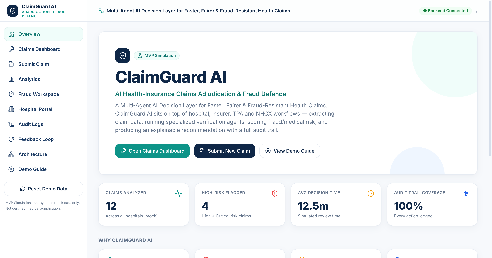
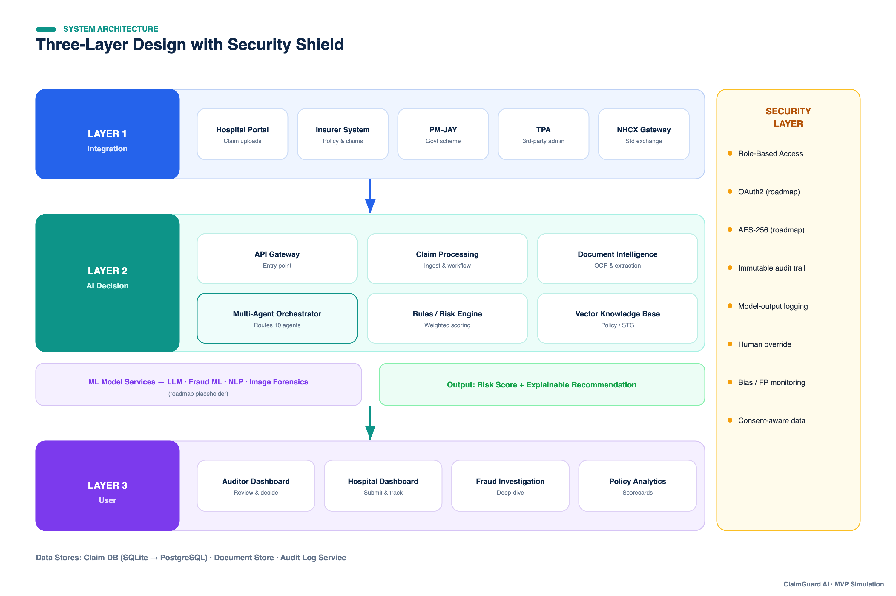
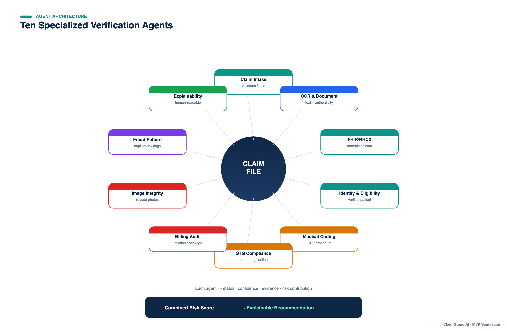
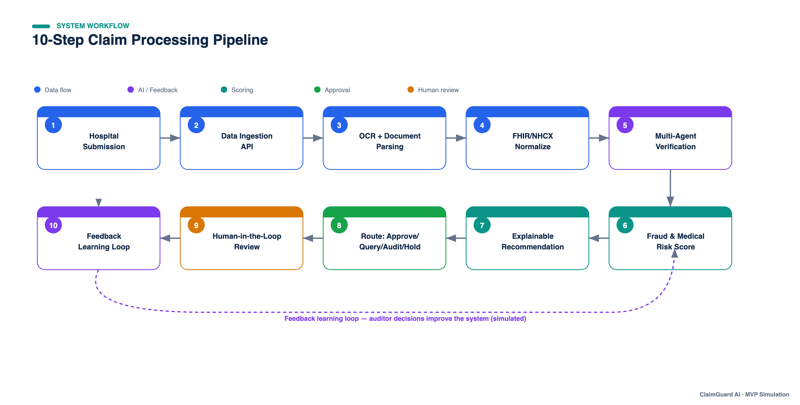
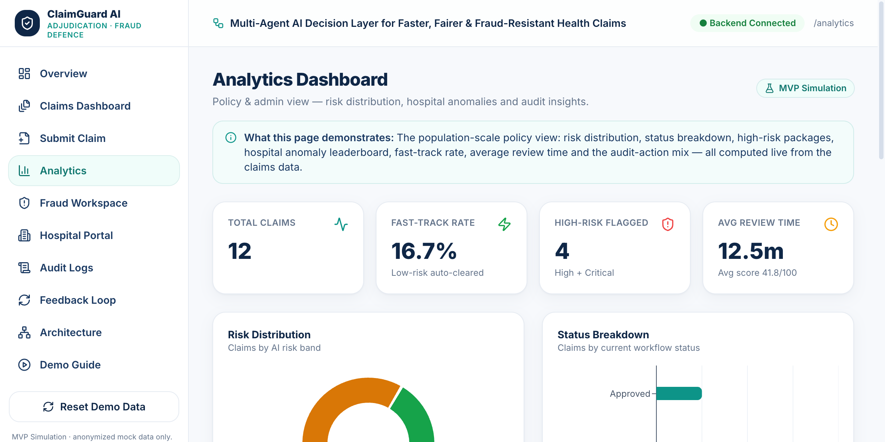
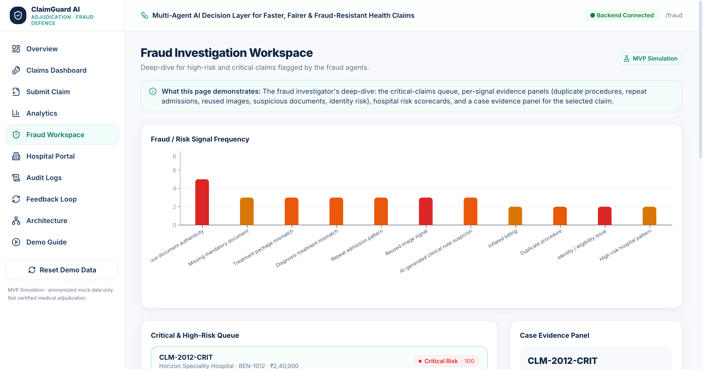
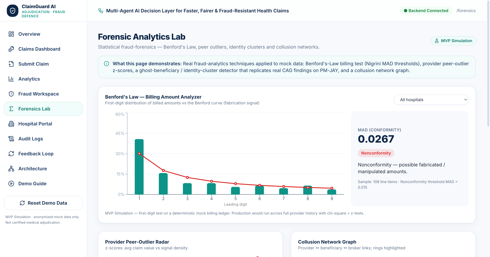

<div align="center">


# ClaimGuard AI

### AI Health-Insurance Claims Adjudication &amp; Fraud Defence

**A Multi-Agent AI Decision Layer for Faster, Fairer &amp; Fraud-Resistant Health Claims**

<p>


</p>
<p>


</p>

<a href="#-quickstart"><b>Quickstart</b></a> ·
<a href="#-features"><b>Features</b></a> ·
<a href="#-architecture"><b>Architecture</b></a> ·
<a href="#-api"><b>API</b></a> ·
<a href="DEPLOY.md"><b>Deploy</b></a> ·
<a href="docs/ClaimGuard_AI_Technical_Documentation.pdf"><b>Technical PDF</b></a>

</div>

> [!IMPORTANT]
> **MVP Simulation.** ClaimGuard AI is a hackathon prototype built on **anonymized mock data** with
> **explainable, rule-based demo logic**. It is **not** certified medical adjudication and has **no** real
> PM-JAY / NHCX integration, **no** real patient data, and **no** trained fraud model. Every recommendation
> is designed for **human-in-the-loop** review — the AI recommends, a human decides.

<div align="center">

</div>

---

## 🎯 The problem

India processes **~40,000 health-insurance claims per day** under PM-JAY. Most are genuine — but some hide
wrong treatment packages, **manipulated documents**, **inflated bills**, **ghost identities**, **duplicate
procedures**, **reused medical images**, and even **AI-generated fake clinical notes**. Manual review is
**slow, inconsistent, reactive, and impossible to scale** — causing delays for genuine patients and fraud
leakage for the system.

## 💡 The solution

An **AI co-pilot** that sits between hospitals and payers. Each claim flows through **ten specialized
verification agents** → a deterministic **0–100 risk score** → an **explainable recommendation**, with a
**human auditor making the final call** and a complete **audit trail** behind every decision.

<table>
<tr><th>Score</th><th>Risk band</th><th>Recommended action</th></tr>
<tr><td><code>0–25</code></td><td>🟢 <b>Low</b></td><td>Auto-approve / Fast-track</td></tr>
<tr><td><code>26–50</code></td><td>🟡 <b>Medium</b></td><td>Query Hospital</td></tr>
<tr><td><code>51–75</code></td><td>🟠 <b>High</b></td><td>Medical Auditor Review</td></tr>
<tr><td><code>76–100</code></td><td>🔴 <b>Critical</b></td><td>Fraud Investigation Hold</td></tr>
</table>

---

## ⚡ Quickstart

```bash
# 1 ── Backend (FastAPI · http://localhost:8000)
cd backend
python3 -m venv .venv && source .venv/bin/activate     # Windows: .venv\Scripts\activate
pip install -r requirements.txt
uvicorn app.main:app --reload --port 8000              # auto-seeds 12 demo claims

# 2 ── Frontend (React + Vite · http://localhost:5173)
cd frontend
npm install
npm run dev
```

Open **<http://localhost:5173>** → the Vite dev server proxies `/api` to the backend. API docs live at
**<http://localhost:8000/docs>**.

<details>
<summary><b>🐳 Run with Docker (single service — same as production)</b></summary>

```bash
docker compose up --build      # → http://localhost:8000  (API + UI from one container)
```
</details>

<details>
<summary><b>🧪 Run the test suite</b></summary>

```bash
cd backend && source .venv/bin/activate && pytest -q     # 35 tests
```
</details>

---

## ✨ Features

| | Capability | What it does |
|---|---|---|
| 🤖 | **10-Agent Verification** | Intake · OCR/Document · FHIR/NHCX · Identity · Coding · STG · Billing · Image · Fraud Pattern · Explainability |
| 📊 | **Deterministic Risk Engine** | Fixed, auditable 12-signal catalogue → capped 0–100 score → four action bands |
| 🧾 | **Explainable Reports** | Exact score-attribution waterfall, evidence table, audit trail · print / export JSON |
| 🧑‍⚖️ | **Human-in-the-Loop** | Five auditor actions, each writing an audit log + feedback event — never auto-settles |
| 🔬 | **Forensic Analytics Lab** | Benford's-Law billing test · provider peer-outlier z-scores · ghost-beneficiary detector · collusion graph |
| 📈 | **Policy Analytics** | Risk distribution, hospital anomaly leaderboard, fast-track rate, fraud-pattern counts |
| 🛰️ | **Hospital Portal** | Claim tracking, auditor queries, missing-document requests, resubmit flow |
| 🔁 | **Feedback Loop** | Captures auditor decisions + a simulated rule-improvement / drift-monitoring queue |
| 🗂️ | **Immutable-style Audit Trail** | Every action logged with role, status change, reason and an output-hash placeholder |

> 🔬 The **Forensics Lab** is the standout: every technique is a *real* fraud-analytics method
> (Nigrini MAD thresholds, z-score outlier detection, graph-based collusion analysis) — and the
> ghost-beneficiary detector deliberately **replicates patterns from real CAG audits of PM-JAY**
> (e.g. many beneficiaries sharing one mobile number) on **synthetic** data.

---

## 🏗 Architecture

A decoupled React SPA talks to a FastAPI backend whose service layer implements the AI decision logic over SQLite.

<div align="center">

</div>

<details>
<summary><b>🧠 Multi-agent design &amp; end-to-end workflow</b></summary>

<div align="center">

<br/><br/>

</div>

More diagrams in [`docs/architecture_diagrams/`](docs/architecture_diagrams): high-level architecture,
data-flow (DFD), risk-scoring flow, data-model (ER), and deployment.
</details>

### Tech stack

| Layer | Technology |
|---|---|
| **Frontend** | React 18 · Vite 6 · TypeScript 5 · Tailwind CSS 3 · Recharts · Lucide |
| **Backend** | FastAPI · Uvicorn · Pydantic v2 |
| **Data** | SQLAlchemy 2 · SQLite |
| **Testing** | Pytest · HTTPX TestClient *(35 tests)* |
| **Deploy** | Docker · Railway *(single service)* |

### Risk engine in one line

```text
score = min( Σ weight(signal) for every active signal , 100 )   →   band   →   recommended action
```

Signals are set explicitly **or derived from data** (missing mandatory document; `claim_amount > package_rate × 1.15`).
Each weight is fixed and auditable — so the score-attribution waterfall is **exact, not estimated**.

---

## 🔌 API

The backend serves a JSON API under **`/api/*`** and the React SPA at `/`. Highlights:

| Method | Endpoint | Purpose |
|---|---|---|
| `GET` | `/health` | Health check (Railway probe) |
| `GET` · `POST` | `/api/claims` | List/filter · create + analyze a claim |
| `POST` | `/api/claims/{id}/analyze` | Run the 10-agent verification |
| `GET` | `/api/claims/{id}/report` | Explainable decision report |
| `GET` | `/api/claims/{id}/explanation` | Deterministic score-attribution waterfall |
| `POST` | `/api/claims/{id}/decision` | Record auditor decision → status + audit + feedback |
| `GET` | `/api/forensics/{benford·peer-outliers·identity-flags·network}` | Forensic analytics |
| `GET` | `/api/analytics/{overview·fraud-patterns·hospitals}` | Policy analytics |
| `GET` · `POST` | `/api/feedback` · `/api/audit-logs` · `/api/demo/reset` | Feedback · audit · demo control |

```bash
curl -s localhost:8000/api/analytics/overview | python3 -m json.tool
curl -s localhost:8000/api/claims/CLM-2012-CRIT/explanation        # exact score breakdown
```

<details>
<summary><b>📁 Project structure</b></summary>

```
claimguard-ai/
├── backend/
│   ├── app/
│   │   ├── main.py              # FastAPI app — serves /api + the built SPA
│   │   ├── models.py · schemas.py · database.py · seed_data.py
│   │   ├── services/           # risk · agent · report · analytics · forensics engines
│   │   └── routers/            # claims · reports · forensics · analytics · audit · feedback · demo
│   ├── tests/                  # 35 pytest tests
│   └── requirements.txt
├── frontend/
│   └── src/
│       ├── pages/              # 14 route pages
│       ├── components/         # Layout · RiskGauge · AgentCard · ScoreWaterfall · …
│       └── api/ · types/ · data/ · utils/ · styles/
├── docs/                       # technical PDF · pitch deck · architecture diagrams · UI screenshots
├── Dockerfile · docker-compose.yml · railway.json · DEPLOY.md
└── README.md
```
</details>

---

## 🚀 Deploy to Railway (one service, one URL)

ClaimGuard AI deploys as a **single Railway service** — one Dockerfile builds the React app and serves it
together with the API. No CORS, no env vars, nothing to wire.

1. Push this repo to GitHub.
2. Railway → **New Project → Deploy from GitHub repo** → select it.
3. Railway detects [`railway.json`](railway.json) + the root [`Dockerfile`](Dockerfile) and builds automatically.
4. **Settings → Networking → Generate Domain** → open the URL. 🎉

Full guide, CLI steps, and optional data-persistence volume: **[DEPLOY.md](DEPLOY.md)**.

---

## 🎬 Demo

The seed data ships twelve scenario claims spanning every risk band and fraud pattern:

| Claim | Scenario | Score | Band |
|---|---|---|---|
| `CLM-2001-GEN` | Clean claim | `0` | 🟢 Low |
| `CLM-2005-OPHTH` | Duplicate procedure | `43` | 🟡 Medium |
| `CLM-2007-RAD` | Reused diagnostic image | `52` | 🟠 High |
| `CLM-2009-MAT` | Ghost identity | `82` | 🔴 Critical |
| `CLM-2012-CRIT` | Six concurrent fraud signals | `100` | 🔴 Critical |

<details>
<summary><b>🖼 Screenshot gallery</b></summary>

<div align="center">

**Analytics Dashboard**


**Fraud Investigation Workspace**


**Forensic Analytics Lab**


</div>
</details>

A click-by-click 5-minute walkthrough is built into the app at `/demo-guide`, and the full deck lives at
[`docs/ClaimGuard_AI_Presentation_Deck.pdf`](docs/ClaimGuard_AI_Presentation_Deck.pdf).

---

## ⚖️ Scope &amp; honesty

This is an MVP that proves the **workflow and value end-to-end** — deliberately rule-based for
**explainability, safety and reproducibility** (the source project scopes ML to the production phase).

<table>
<tr><th>✅ Implemented</th><th>🛣️ Roadmap (not live)</th></tr>
<tr><td valign="top">

- Multi-agent verification + 0–100 risk engine
- Explainable reports + exact attribution
- Human-in-the-loop actions + audit trail
- Forensic analytics on mock data
- Single-service deploy

</td><td valign="top">

- Real PM-JAY / NHCX / FHIR integration
- Trained fraud ML + image forensics
- Real OCR &amp; document authenticity
- OAuth2 / AES-256 / tamper-proof ledger
- Continuous model learning

</td></tr>
</table>

Full breakdown in the **[Technical Documentation PDF](docs/ClaimGuard_AI_Technical_Documentation.pdf)**.

---

<div align="center">

**Faster claims · Lower fraud · Higher trust = Better healthcare access**

Built with FastAPI + React · Licensed under [MIT](LICENSE)

<sub>MVP Simulation — anonymized mock data only · no real PM-JAY/NHCX integration · no real patient data · human-in-the-loop by design.</sub>

</div>
